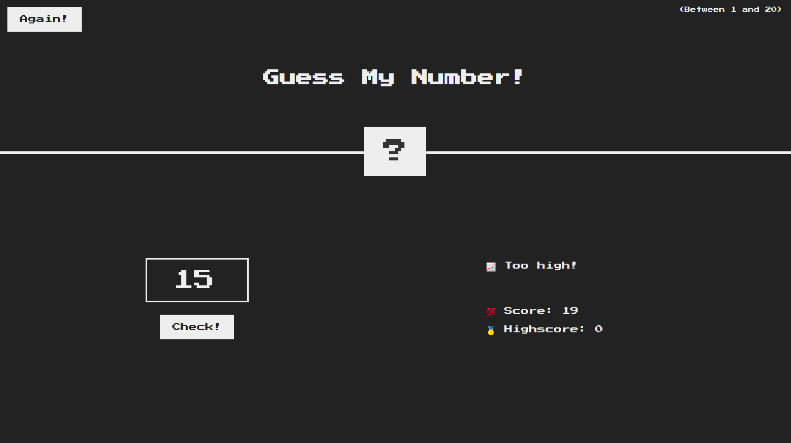
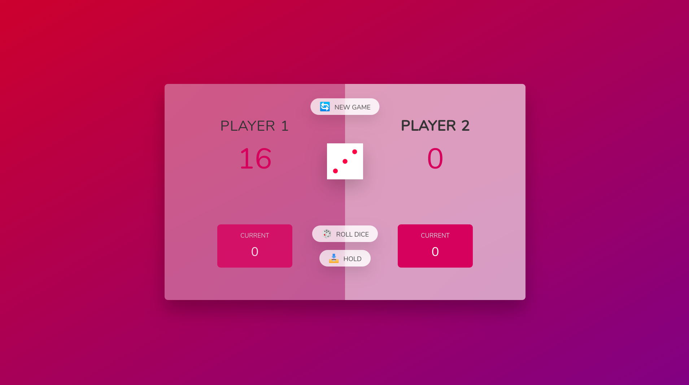

# Javascript course

In this course, the fundamentals of javascript, language paradigms, synchronous and asynchronous functions, data structures, modern operators were studied.

Futhermore, the following applications were developed throughout the course:

## Guess my number

</img>

## Pig game

</img>

## Bankist
